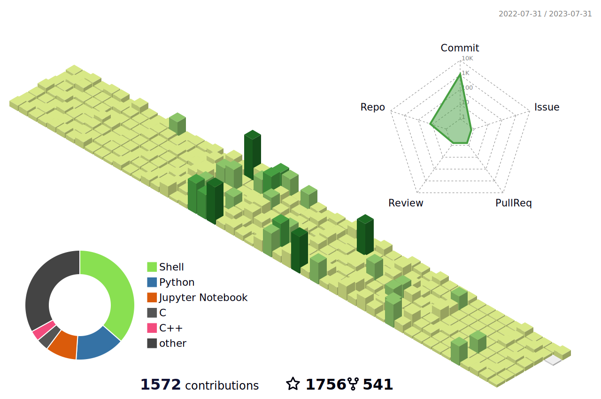

<!--   my-icons -->
<p align="center">
    <a href="https://github.com/shicxin/shicxin"></a>
    <a href="https://github.com/python/cpython"></a>
    <a href="https://github.com/python/cpython"></a>
    <a href="https://github.com/python/cpython"></a>
    <a href="https://github.com/shicxin/shicxin/graphs/contributors"></a>
    <a href="https://github.com/shicxin/shicxin/stargazers"></a>
    <a href="https://github.com/shicxin/shicxin/network/members"></a>
       
</p>

<!--   my-ticker -->    
[](https://git.io/typing-svg)


<!--   my-kaggle     
### My achievements on [kaggle](https://www.kaggle.com/andrej0marinchenko):


-->


<!--   my-skils -->

| Property             | Data                                                         |
| -------------------- | ------------------------------------------------------------ |
| **Language / IDE**   |  |
| **CI / CD**          | [](https://github.com/shicxin/shicxin) [](https://github.com/shicxin/shicxin) [](https://github.com/shicxin/shicxin) |
| **Databases**        |  |
| **Tools & Platform** |  |
| **OS**               |  |


<!--   GitHub stats graph -->
<!--   GitHub stats graph -->
### 📈 GitHub Activity Graph:
<!-- [](https://github.com/shicxin/github-readme-activity-graph) -->

| .                                                                                                                                       | .                                                                                                                         |
|-----------------------------------------------------------------------------------------------------------------------------------------|---------------------------------------------------------------------------------------------------------------------------|
|  |  |

</img>

<!--   profile-green-animate -->


<!--   grid-snake -->


<div align="center">
<summary>Trophy: Hackerrank Profile Trophy</summary>
</div>


<!-- Belarus - My Home-->
```geojson
{
  "type": "FeatureCollection",
  "features": [
    {
      "type": "Feature",
      "properties": {},
      "geometry": {
        "coordinates": [
          108.93236120819677,
          34.15348671295591
        ],
        "type": "Point"
      }
    }
  ]
}
```


#### Thanks for visiting :heart:

<p align="center"> 
  

### Profile Views
counting of visitors to this page in this section started from June 12, 2022


</br>

[MIT](LICENSE)


</p>


